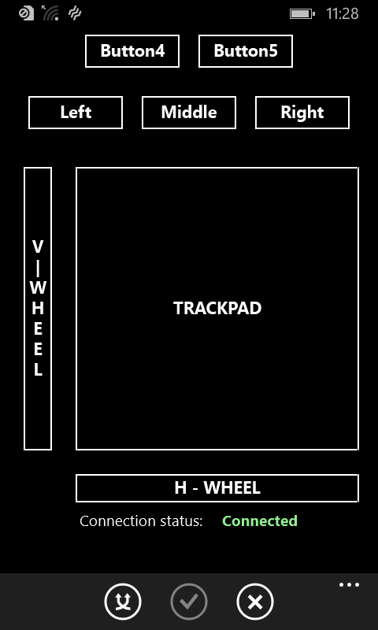

# wp81mouse
Turns your _Lumia 520_ into a kind of _Microsoft Bluetooth Mobile Mouse 3600_.  
Based on [wp81mouseJiggler](https://github.com/fredericGette/wp81mouseJiggler).  

  

## Features

The simulated mouse has 5 buttons and 2 wheels.  
You can toggle the _Jiggler_ button to activate/deactive an option which autmatically sends a mouse mouvement every second.  

Once the mouse is paired with another device, the next connections doesn't require further pairing.  
In case of communication problem (mainly caused by _Message Integrity Check_ error), the mouse automatically resets the connection after a certain amount of time.  

In case of inactivity, the mouse periodically sends an empty notification to avoid a connection timeout.  

## Deployment

Compilation requires Visual Studio 2015 with Windows Phone 8.1 support.  

Execution requires a Lumia 520 rooted with [WPinternals](https://github.com/ReneLergner/WPinternals).  

Deploy the .appx from the root of this GitHub repository using [CMD.Injector](https://github.com/fadilfadz01/CMD.Injector_WP8) or the _Windows Phone Application Deployment_ tool installed along Visual Studio.

This program requires **the kernel drivers "wp81controldevice.sys" and "wp81hcifilter.sys"**  
See [wp81btmon](https://github.com/fredericGette/wp81btmon/tree/main?tab=readme-ov-file#installation-of-the-kernel-drivers-wp81controldevicesys-and-wp81hcifiltersys) for their installation.  
